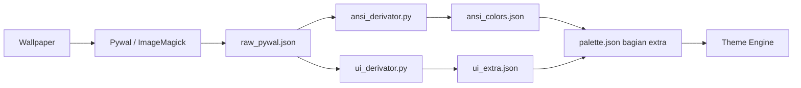

# Alur Kerja Pembuatan Palette

Direktori ini berisi tools Python untuk mengekstrak warna dari wallpaper dan mendistribusikannya secara benar ke dalam arsitektur `palette.json` milik Theme Engine.

---

## Masalah dengan Pywal Mentah

Saat lu ngekstrak 16 warna dari gambar pake ImageMagick atau Pywal, lu dapet "snapshot" dari warna dominan gambar (misal: 16 warna hijau dan coklat buat hutan).

- **UI (Waybar, GTK)**: Warna mentah ini biasanya gak punya hierarki yang bener. Background kurang gelap, teks kurang terang, jadinya jelek.
- **Terminal / Syntax (Nvim)**: Syntax highlighting lu bakal hancur karena semua warnanya mirip-mirip. Keyword, string, dan error semuanya jadi warna hijau.

---

## Solusi: Derivasi Terpisah

Kita pisahin generasi warna jadi **dua tugas terpisah**:

1. **UI Generator** (`ui_derivator.py`): Buat warna semantik (layer, text, accent) — dipake sama Waybar, GTK, Hyprland, background editor Nvim.
2. **ANSI Generator** (`ansi_derivator.py`): Buat warna terminal 16 warna — dipake sama syntax highlighting Nvim, Kitty, Foot, dll.

---

## Tool 1: `ansi_derivator.py`

### Deskripsi
Generator warna **ANSI 16 warna** (color0 - color15) yang **fungsional** buat syntax highlighting. Tool ini ngambil hue standar (Merah, Hijau, Biru, Kuning, Cyan, Magenta) lalu nge-*tint* (ngasih sedikit warna) ke arah *base hue* wallpaper. Hasilnya: warna sintaks tetep jelas beda (Red ya merah, Green ya hijau) tapi tetep nyambung secara estetik ke vibe wallpaper.

### Input
| Argumen | Deskripsi | Contoh |
|---|---|---|
| `input` | Path ke JSON hasil Pywal (`colors.json`) | `raw_pywal.json` |
| `-o` / `--output` | Path file output JSON (default: `ansi_colors.json`) | `-o ansi_output.json` |
| `--light` | Flag kalo lu mau generate buat tema terang (opsional) | `--light` |

**Format Input (`raw_pywal.json`)** — file JSON standar punya Pywal:
```json
{
  "special": {
    "background": "#0a0a0a",
    "foreground": "#c1c1c1"
  },
  "colors": {
    "color0": "#0a0a0a",
    "color1": "#717171",
    "color2": "#8E6C77",
    "color3": "#7D7F80",
    "color4": "#7F8081",
    "color5": "#8E8E8E",
    "color6": "#9FA0A0",
    "color7": "#c1c1c1",
    "color8": "#5F5F5F",
    "color9": "#A2A2A2",
    "color10": "#B59FA6",
    "color11": "#AAABAC",
    "color12": "#ABACAD",
    "color13": "#B5B5B5",
    "color14": "#C0C1C1",
    "color15": "#D6D6D6"
  }
}
```

### Output
File JSON dengan 16 warna ANSI dalam bentuk **array berurutan index 0–15**:

```json
{
  "description": "ANSI 16-color palette tinted to hue 340°",
  "colors": [
    "#1b1718",
    "#c08a8f",
    "#aac08a",
    "#c0a48a",
    "#948ac0",
    "#bc8ac0",
    "#8a9cc0",
    "#d9d7d8",
    "#53454a",
    "#d4aaad",
    "#c2d4aa",
    "#d4beaa",
    "#b1aad4",
    "#d0aad4",
    "#aab8d4",
    "#f2f1f2"
  ]
}
```

| Index | ANSI Role |
|---|---|
| 0–7 | Normal colors |
| 8–15 | Bright colors |

**Output ini menggantikan array `"colors"` (0-15) di `palette.json`.**

### Cara Pakai
```bash
./ansi_derivator.py raw_pywal.json -o ansi_colors.json
```

---

## Tool 2: `ui_derivator.py`

### Deskripsi
Generator warna **semantik** untuk UI. Tool ini nganalisa *lightness range*, *saturation*, dan *base hue* dari Pywal. Lalu secara matematis nge-bangun palette semantik ala Catppuccin:
- Layer backgrounds (crust paling gelap, base, surface)
- Text foregrounds (primary, muted)
- Accents (primary, secondary)
- Borders (active, default)

Outputnya berupa **objek `"extra"`** yang siap dimasukin ke `palette.json`.

### Input
| Argumen | Deskripsi | Contoh |
|---|---|---|
| `input` | Path ke JSON hasil Pywal (`colors.json`) | `raw_pywal.json` |
| `-o` / `--output` | Path file output JSON (default: `ui_colors.json`) | `-o ui_extra.json` |
| `--light` | Flag kalo lu mau generate buat tema terang (opsional) | `--light` |

**Format Input (`raw_pywal.json`)** — SAMA persis kayak input di `ansi_derivator.py` di atas.

### Output
File JSON dengan struktur `"extra"` yang udah siap:

```json
{
  "extra": {
    "accent": {
      "primary": "#...",
      "secondary": "#...",
      "on_accent": "#..."
    },
    "text": {
      "primary": "#...",
      "secondary": "#...",
      "muted": "#...",
      "link": "#..."
    },
    "layer": {
      "base": "#...",
      "mantle": "#...",
      "crust": "#...",
      "surface": "#...",
      "surface_raised": "#...",
      "surface_overlay": "#..."
    },
    "border": {
      "default": "#...",
      "active": "#..."
    }
  }
}
```

**Output ini menggantikan objek `"extra"` di `palette.json`.**

### Cara Pakai
```bash
./ui_derivator.py raw_pywal.json -o ui_extra.json
```

---

## Alur Lengkap (Step by Step)



### Step 1: Ekstrak Warna Mentah dari Wallpaper

**Pake Pywal:**
```bash
wal -i /path/to/wallpaper.jpg -n
cp ~/.cache/wal/colors.json ./raw_pywal.json
```

**Atau pake ImageMagick langsung (alternatif):**
```bash
magick /path/to/wallpaper.jpg -resize 600x600 -colors 16 -unique-colors txt:- | grep -oP '#[0-9A-Fa-f]{6}' | head -16
```

### Step 2: Hasilkan Warna ANSI (Buat Terminal & Syntax Nvim)
```bash
./ansi_derivator.py raw_pywal.json -o ansi_colors.json
```

Buka `ansi_colors.json`, ambil array warna dari object `"colors"`, terus masukin ke bagian `"colors"` di `palette.json` lu.

### Step 3: Hasilkan Warna UI (Buat Waybar, GTK, Hyprland, dll)
```bash
./ui_derivator.py raw_pywal.json -o ui_extra.json
```

Buka `ui_extra.json`, ambil object `"extra"`, terus masukin ke bagian `"extra"` di `palette.json` lu.

### Step 4: Gabungin ke `palette.json`

Struktur akhir `palette.json` kira-kira bakal gini:

```json
{
  "palettes": {
    "dark": {
      "background": "...",
      "foreground": "...",
      "cursor": "...",

      "colors": [                // ⬅️ Dari ansi_colors.json
        "#...", "#...", "#...", "#...",
        "#...", "#...", "#...", "#...",
        "#...", "#...", "#...", "#...",
        "#...", "#...", "#...", "#..."
      ],

      "extra": {                  // ⬅️ Dari ui_extra.json
        "accent": { ... },
        "text": { ... },
        "layer": { ... },
        "border": { ... },
        "status": { ... }
      }
    }
  }
}
```

### Step 5: Generate Semua Output
```bash
./runner.sh build && ./runner.sh dev
```

---

## Ringkasan

| Tool | Domain | Input | Output |
|---|---|---|---|
| `ansi_derivator.py` | Terminal, Nvim Syntax | `raw_pywal.json` | `color0` - `color15` yang fungsional & harmonis |
| `ui_derivator.py` | Waybar, GTK, UI Editor | `raw_pywal.json` | Objek `extra` (layer, text, accent) yang semantik |
